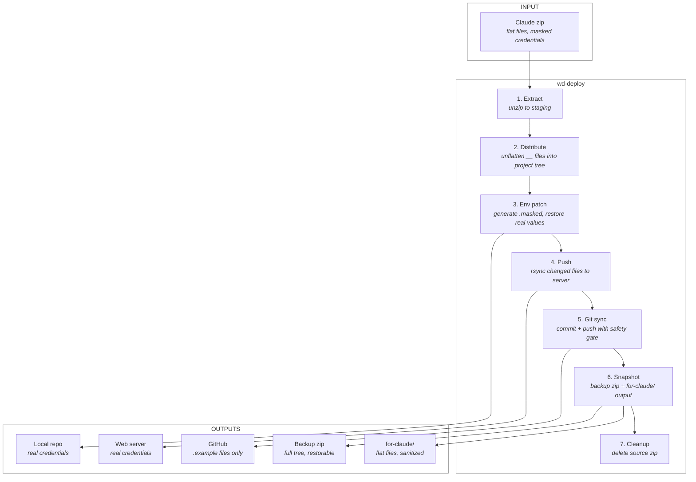

# Deploy Pipeline

Automates the flow of code between an AI-assisted development workflow and four deployment targets — local repo, web server, GitHub, and snapshot — while ensuring environment-specific secrets never leave the local machine.


## Command usage

All tools default to **dry run**. Pass `-d FALSE` to execute for real.

### wd-deploy — full pipeline

```
wd-deploy <profile>              # Dry-run the full pipeline
wd-deploy <profile> -d FALSE     # Execute all stages for real
wd-deploy <profile> --no-git     # Skip the git sync stage
wd-deploy list                   # List available websync profiles
```

### wd-websync — rsync push/pull

```
wd-websync push <profile>                  # Dry-run push to server
wd-websync push <profile> -d FALSE         # Push to server
wd-websync pull <profile> -d FALSE         # Pull from server
wd-websync push <profile> --delete         # Push + remove server-only files
wd-websync push <local> <host:remote>      # One-off push (no profile)
wd-websync config <profile>                # Create or edit a profile
wd-websync show <profile>                  # View profile settings
wd-websync delete <profile>                # Delete a profile
wd-websync list                            # List saved profiles
```

### wd-gitsync — git commit + push with safety gate

```
wd-gitsync <profile>                       # Dry-run git sync
wd-gitsync <profile> -d FALSE              # Commit and push
wd-gitsync <profile> -d FALSE -m "msg"     # Commit with custom message
wd-gitsync /path/to/project                # Use direct path
wd-gitsync list                            # List websync profiles
```

### wd-snapshot — backup + Claude-ready output

```
wd-snapshot <profile>                      # Dry-run snapshot
wd-snapshot <profile> -d FALSE             # Execute snapshot
wd-snapshot /path/to/project               # Use direct path
wd-snapshot list                           # List websync profiles
```

### Installation

```bash
chmod +x webdev-deploy-pipeline-installation.sh
./webdev-deploy-pipeline-installation.sh
```

Installs `wd-lib.sh`, `wd-deploy`, `wd-snapshot`, `wd-websync`, and `wd-gitsync` to `/usr/local/bin/`.


### Prerequisites

**Local machine:**
- `rsync`, `git`, `unzip`, `zip` installed and in PATH
- `~/.ssh/config` entry for the web server (hostname, user, key path)
- `git config` set with `user.name` and `user.email`

**Web server (push target):**
- SSH key authentication configured (password auth not supported by the pipeline)
- `rsync` installed on the remote host
- Target directory created (or let wd-websync create it on first push)

**GitHub (git sync target):**
- SSH key added to your GitHub account (Settings → SSH and GPG keys)
- Remote set to SSH format: `git@github.com:user/repo.git` (not `https://`)
- Verify with: `ssh -T git@github.com`


## Pipeline flow




## File routing

Secret-bearing files exist in three forms. Each has a different audience and routing rule:

| File | Maintained by | Server | GitHub | Claude | Snapshot |
|------|--------------|--------|--------|--------|----------|
| `config.php` | Pipeline (patched) | ✓ real | ✗ .gitignore | ✗ excluded | ✓ real |
| `config.masked.php` | Pipeline (auto-generated) | ✓ synced | ✗ .gitignore | ✓ collected | ✓ included |
| `config.example.php` | Developer / Claude AI | ✓ synced | ✓ tracked | ✓ collected | ✓ included |

**Real file** — Contains actual credentials. Lives in the local repo and on the server. Never reaches GitHub or Claude.

**Masked file** — Auto-generated by Stage 3 from the Claude zip before patching. Contains the full config structure with `********` sentinel placeholders. Claude uses this to understand the layout without seeing real values. Gitignored.

**Example file** — A hand-crafted onboarding template maintained by the developer (or Claude AI). Contains descriptive comments and safe defaults. Tracked in GitHub so anyone cloning the repo can copy it and fill in their values.

| File type | Local repo | Web server | GitHub | Snapshot zip | for-claude/ |
|-----------|-----------|------------|--------|-------------|-------------|
| Secret files (per `deploy.conf`) | Real credentials | Real credentials | `.gitignore` | Real (restorable) | Excluded |
| `.masked` files (auto-generated) | Masked (auto-updated) | Synced | `.gitignore` | Included | Collected |
| `.example` files (developer-maintained) | Template | Synced | Tracked | Included | Collected |
| All other files | As-is from Claude | Synced from local | Tracked | Included | Collected |


## deploy.conf — the project contract

Every project declares its secret-bearing files in a single config file at the project root: `deploy.conf`. This is the only file that contains project-specific knowledge. The pipeline tools are entirely project-agnostic — they read `deploy.conf` to determine what to save, patch, and exclude.

If `deploy.conf` doesn't exist when wd-deploy runs, the pipeline offers to create a commented template with syntax reference and common examples.

**Format:**

```
# SYNTAX
#   file <path>             Declares a secret-bearing file (relative to project root)
#   patch <grep_pattern>    A line to capture and restore (belongs to preceding file)

file config.php
patch define('SITE_URL'
patch define('DB_HOST'
patch define('DB_NAME'
patch define('DB_USER'
patch define('DB_PASS'
patch define('SMTP_HOST'
patch define('SMTP_USER'
patch define('SMTP_PASS'
patch define('SMTP_PORT'
patch define('SMTP_FROM'
patch define('SMTP_NAME'

file public/.htaccess
patch auto_prepend_file
```

**Three consumers, one source:**

| Consumer | What it reads | What it does with it |
|----------|--------------|---------------------|
| wd-deploy Stage 3 | `file` entries + `patch` patterns | Saves real values before overwrite, copies masked → `.masked`, patches real values back |
| wd-gitsync | `file` entries | Verifies every declared file AND its `.masked` counterpart is in `.gitignore` before pushing |
| wd-snapshot | `file` entries | Excludes listed files from for-claude/ output |

**Swapping projects** means swapping the config. Same tools work for any project:

```
# PHP project                    # Node project
file config.php                  file .env
patch define('DB_PASS'           patch DB_HOST=
patch define('SMTP_HOST'         patch DB_PASS=
file public/.htaccess            patch API_KEY=
patch auto_prepend_file
```

**What deploy.conf is not:** It is not secret. It contains grep patterns, not values. It documents which files need environment-specific setup — useful for anyone cloning the repo. It belongs in version control.

**.masked naming convention:** Auto-derived from `file` entries. Normal files: `.masked` inserted before the extension (`config.php` → `config.masked.php`). Dotfiles: `.masked` appended (`.htaccess` → `.htaccess.masked`).

**.gitignore setup** — add the `file` entries AND their `.masked` counterparts:
```
# Real credentials (per deploy.conf)
config.php
public/.htaccess

# Masked files (auto-generated by deploy Stage 3)
config.masked.php
public/.htaccess.masked
```

wd-gitsync enforces this alignment on every push.


## Pipeline stages in detail

### Stage 1: Extract

Unzips the Claude-delivered file into a temporary staging area. If the zip contains a single top-level folder, the pipeline descends into it automatically.

### Stage 2: Distribute

**Phase A — Capture.** Before any files are overwritten, the pipeline copies the current versions of every file listed in `deploy.conf` from the local repo into a temp directory. These copies preserve the real environment-specific values for use in Stage 3. On a first deploy where these files don't exist yet, the capture is skipped.

**Phase B — Overwrite.** Each file from the zip is copied into the local project tree. Files with `__` in their name are unflattened into subdirectories (`core__footer.php` → `core/footer.php`). Files without `__` are placed at the project root (`index.php` → project root). A rollback manifest tracks every overwritten file.

### Stage 3: Env patch

**A — Copy sanitized → .masked.** Before patching, the still-masked versions of files listed in `deploy.conf` are copied to their `.masked` counterparts. These contain the full config structure with sentinel placeholders — what Claude needs to understand the layout without seeing real credentials. Tracked in the rollback manifest.

**B — Patch real values.** For each `file` entry in `deploy.conf`, the pipeline walks its `patch` patterns. Each pattern is a fixed-string grep match used twice: against the post-distribute file to find the target line number, and against the saved pre-distribute copy to extract the full replacement line. Awk swaps by line number — whole-line replacement, no regex on values, no escaping required. Handles quoted strings, bare integers, paths with special characters — anything.

`.example` files are not touched — they are maintained by the developer (or Claude AI) and exist as regular project files.

### Stage 4: Push

Pushes changed local files to the web server via rsync. Only modified files are transferred — this is a copy operation, not a mirror. Files deleted locally are not removed on the server. To explicitly clean up server-only files, use `wd-websync push <profile> --delete` as a separate step.

### Stage 5: Git sync

Commits and pushes to the git remote. Automatic when the project has `.git`, `wd-gitsync` is installed, and `--no-git` was not passed. Skipped silently otherwise.

**Credential safety gate:** Before pushing, wd-gitsync verifies every `file` entry in `deploy.conf` — plus each `.masked` counterpart — is in `.gitignore`. Blocks on mismatch.

**Non-fatal failure:** Git sync failure does not trigger a full pipeline rollback. The server push already succeeded. The developer chooses: continue to snapshot or stop and fix.

**Commit message:** Auto-generated from the staged diff (e.g., `Deploy: 3 modified, 1 added`). When run standalone, prompts for confirmation or a custom message.

### Stage 6: Snapshot

Creates two outputs:

**Backup zip** — Full project tree (real values included) with a snapshot log containing directory tree, file details, and MD5 checksums. This is the rollback artifact.

**for-claude/ directory** — Flat files for Claude project upload. Secret files (per `deploy.conf`) are excluded. Root-level files keep bare names; subdirectory files use `__` delimiters. `.masked` and `.example` files are collected normally.

### Stage 7: Cleanup

Deletes the source zip. All other artifacts are preserved.


## Rollback

If any stage fails, the pipeline automatically:

1. Restores all overwritten local files from the backup manifest (including `.masked` files)
2. Removes any newly created files (including newly generated `.masked` files)
3. Re-pushes the pre-deploy local state to the server (if the push stage was reached)
4. Cleans up partial snapshot outputs
5. Preserves the source zip so the deploy can be retried

**Exception:** Git sync (Stage 5) failure is non-fatal. The developer chooses whether to continue or stop. Git commits can be amended or reverted independently.


## Shared library: wd-lib.sh

All pipeline tools source `wd-lib.sh` for shared functions and constants. Installed alongside the tools in `/usr/local/bin/` and located via `dirname "$0"`.

| Function | Used by | Purpose |
|----------|---------|---------|
| `parse_deploy_conf` | wd-deploy | Full parse: file entries + patch patterns |
| `parse_deploy_conf_files` | wd-gitsync, wd-snapshot | File entries only (no patterns) |
| `derive_masked_name` | wd-deploy, wd-gitsync | Compute `.masked` filename from a path |
| `cmd_list_profiles` | wd-deploy, wd-gitsync, wd-snapshot | List available websync profiles |
| `load_websync_profile` | wd-gitsync, wd-snapshot | Read a websync `.conf` file |
| `create_deploy_conf_template` | wd-deploy | Scaffold a new deploy.conf |


## First deploy

On the very first deploy, the local repo won't have `config.php`, `.htaccess`, or whatever files `deploy.conf` declares. The pipeline handles this gracefully:

- If `deploy.conf` doesn't exist, offers to create a commented template
- Stage 2 distributes all files from the zip (including root-level files)
- Pre-distribute capture skips files that don't exist yet
- Stage 3 creates `.masked` copies but skips patching (no saved values to restore)
- Stage 5 verifies `.gitignore` alignment even on first deploy
- A preflight warning lists any declared files not found in the project
- The developer populates real credentials manually after the initial deploy
- Subsequent deploys capture and restore values automatically


## Conventions

- **deploy.conf:** One file in the project root declares all secret-bearing files and their patchable lines. If missing, wd-deploy offers to create a template.
- **Placeholder sentinel:** `********` for credential values; `YOUR_USERNAME` and `YOUR_SITE` for server paths.
- **Flat file naming:** Directory separators become `__` (e.g., `public/pages/login.php` → `public__pages__login.php`). Root-level files keep their bare name (e.g., `index.php` stays `index.php`).
- **Dry run by default:** All tools default to dry run. Pass `-d FALSE` to execute.
- **Profile-based config:** Environment-specific connection settings live in `~/.websync/*.conf`.
- **Shared library:** All tools source `wd-lib.sh` from the same directory as the tool binary.


## Security guarantees

- Credentials never appear in Claude conversations, GitHub repos, or for-claude/ output
- wd-gitsync enforces deploy.conf → .gitignore alignment on every push, checking both real files and their `.masked` counterparts
- `.masked` files are gitignored — they contain sentinel placeholders, not real values, but serve no purpose in version control
- `.example` files are tracked in GitHub — they are safe onboarding templates with no credentials
- Real values exist only in: the local repo, the web server, and the snapshot backup zip
- The snapshot backup zip should be treated as sensitive and stored accordingly
- No network requests are made to resolve credentials — all values are read from local files
- `deploy.conf` contains grep patterns, not secret values — it is safe to commit
